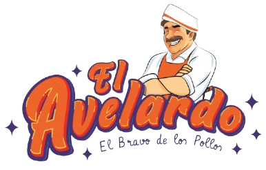

<html>
<head>
    <meta charset="UTF-8">
    <meta name="viewport" content="width=device-width, initial-scale=1.0">
    <title>GANA CON El Avelardo - Cronómetro</title>
    
</head>
<body>

    <h1>GANA CON</h1>
    

        
    

    
00:00.00

    
    

        <button id="startStop">INICIAR</button>
        <button id="reset">REINICIAR</button>
    

    
</body>
</html>
